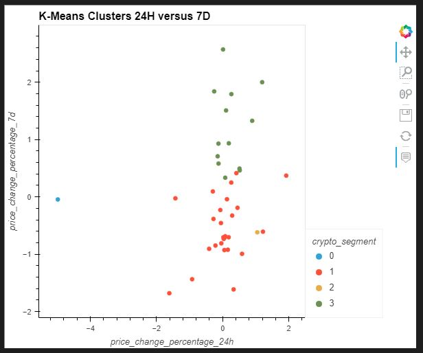
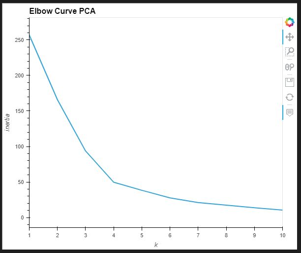
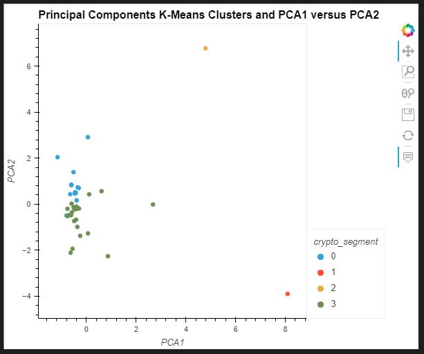
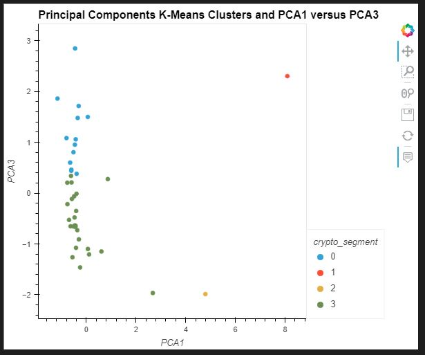
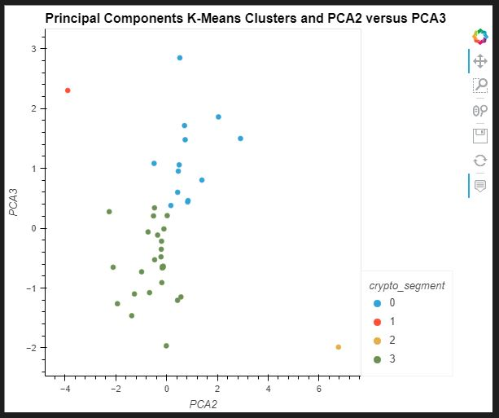

# Crypto Clustering

In this analysis, we used K-Means and Principle Component Analysis (PCA) to cluster crypto curriencies according to their performance in different timeframes. 

###According to our original elbow curve, we decided that best value for k is 4.

###After k-means analysis, our graphs shows us the clusters with different colors.

###As a second analysis, we continue with PCA. We did our analysis with 3 components. Best value for k is 4. 

With the help of PCA, we used less amount of features and this reduces the amount of inertia. The varience in our clustered data decrease because of reduction in dimentionality.  

The original clusters and the pca clusters are matching.  We reached the optimal result with less resources, this is helpful while working with big data.
